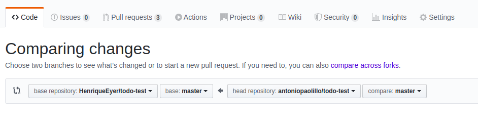
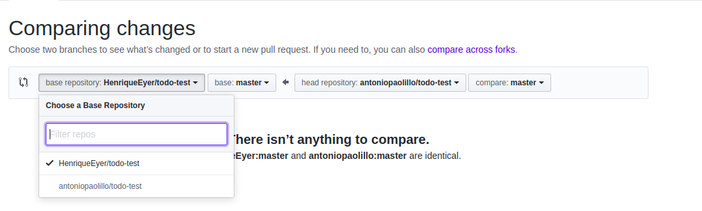
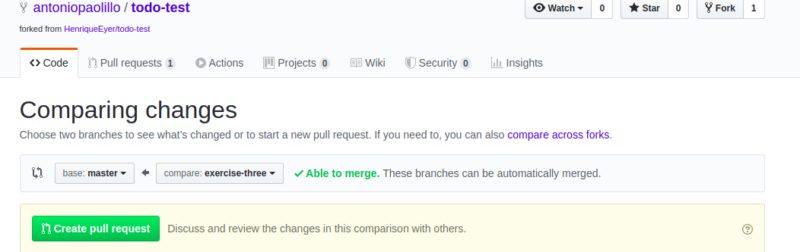

# Boas vindas ao exercício Desafio Técnico: manipulação de DOM

Para realizar o exercício, atente-se a cada passo descrito a seguir e, se tiver qualquer dúvida, nos envie por Slack! #vqv 🚀

## Termos e acordos

Ao iniciar este exercício, você concorda com as diretrizes do Código de Conduta e do Manual da Pessoa Estudante da Trybe.

## Entregáveis

<details>
  <summary><strong>🤷🏽‍♀️ Como entregar</strong></summary><br />

  Para entregar o seu exercício você deverá criar um *Pull Request* neste repositório.

  Lembre-se que você pode consultar nosso conteúdo sobre [Git & GitHub](https://app.betrybe.com/learn/course/5e938f69-6e32-43b3-9685-c936530fd326/module/f04cdb21-382e-4588-8950-3b1a29afd2dd/section/876a615b-f578-4d65-a820-de9f3e5e57db/lesson/be8632bf-7bb7-4c01-a5d9-7aadac3a58f0) e nosso [Blog - Git & GitHub](https://blog.betrybe.com/tecnologia/git-e-github/) sempre que precisar!
</details>

<details>
  <summary><strong>👨‍💻 O que deverá ser desenvolvido</strong></summary><br />
<br />

É hora de aplicar seus conhecimentos em manipular os elementos do HTML! 🤩

Imagine que você recebeu um desafio técnico para uma vaga de emprego em que o objetivo é mostrar suas habilidades em manipulação de DOM. O projeto já veio parcialmente implementado e você deve realizar algumas modificações definidas em Requisitos do Projeto.

Analise o arquivo `index.html` e `style.css`, importante destacar que esses arquivos **não devem ser alterados**.

As alterações necessárias para entregar esse desafio deve ser feita apenas no arquivo `script.js`.

Para avaliar seus conhecimentos de HTML, você deve modificar os elementos já existentes utilizando apenas as funções:

- `document.getElementById();`
- `document.getElementsByClassName();`
- `document.getElementsByTagName();`

</details>

# Orientações
  
<details>
<summary><strong>‼ Antes de começar a desenvolver</strong></summary><br />

1. Clone o repositório

- Use o comando: `git clone git@github.com:tryber/sd-0x-exercise-dom-manipulation.git`
- Entre na pasta do repositório que você acabou de clonar:
  - `cd sd-0x-exercise-dom-manipulation`

2. Instale as dependências e inicialize o projeto

- Instale as dependências:
  - `npm install`

3. Crie uma branch a partir da branch `main`

- Verifique que você está na branch `main`
  - Exemplo: `git branch`
- Se você não estiver, mude para a branch `main`
  - Exemplo: `git checkout main`
- Agora crie uma branch à qual você vai submeter os `commits` do seu projeto:
  - Você deve criar uma branch no seguinte formato: `nome-sobrenome-nome-do-projeto`;
  - Exemplo: `git checkout -b maria-soares-exercise-dom-manipulation`

4. Adicione as mudanças ao *stage* do Git e faça um `commit`

- Verifique que as mudanças ainda não estão no *stage*:
  - Exemplo: `git status` (devem aparecer listados os novos arquivos em vermelho)
- Adicione o novo arquivo ao *stage* do Git:
  - Exemplo:
    - `git add .` (adicionando todas as mudanças - *que estavam em vermelho* - ao stage do Git)
    - `git status` (devem aparecer listados os arquivos em verde)
- Faça o `commit` inicial:
  - Exemplo:
    - `git commit -m 'iniciando o projeto. VAMOS COM TUDO :rocket:'` (fazendo o primeiro commit)
    - `git status` (deve aparecer uma mensagem tipo *nothing to commit* )

6. Adicione a sua branch com o novo `commit` ao repositório remoto

- Usando o exemplo anterior: `git push -u origin maria-soares-exercise-dom-manipulation`

7. Crie um novo `Pull Request` *(PR)*

- Vá até a página de *Pull Requests* do [repositório no GitHub](https://github.com/tryber/sd-0x-exercise-dom-manipulation/pulls)
- Clique no botão verde *"New pull request"*
- Clique na caixa de seleção *"Compare"* e escolha a sua branch **com atenção** - Coloque um título para o seu *Pull Request*
  - Exemplo: *"Cria tela de busca"*
- Clique no botão verde *"Create pull request"*

- Adicione uma descrição para o *Pull Request*, um título nítido que o identifique, e clique no botão verde *"Create pull request"*

 

- Volte até a [página de *Pull Requests* do repositório](https://github.com/tryber/sd-0x-exercise-dom-manipulation/pulls) e confira que o seu *Pull Request* está criado

</details>
<details>
<summary><strong>⌨️ Durante o desenvolvimento</strong></summary><br />

- Faça `commits` das alterações que você fizer no código regularmente pois assim você garante visibilidade para o time da Trybe e treina essa prática para o mercado de trabalho :) ;
- Lembre-se de sempre após um (ou alguns) `commits` atualizar o repositório remoto;
- Os comandos que você utilizará com mais frequência são:

1. `git status` *(para verificar o que está em vermelho - fora do stage - e o que está em verde - no stage)*;

2. `git add` *(para adicionar arquivos ao stage do Git)*;

3. `git commit` *(para criar um commit com os arquivos que estão no stage do Git)*;

4. `git push -u origin nome-da-branch` *(para enviar o commit para o repositório remoto na primeira vez que fizer o `push` de uma nova branch)*;

5. `git push` *(para enviar o commit para o repositório remoto após o passo anterior)*.

</details>
  
<details>
<summary><strong>🕵🏿 Revisando um pull request</strong></summary><br />

Use o conteúdo sobre [Code Review](https://app.betrybe.com/learn/course/5e938f69-6e32-43b3-9685-c936530fd326/module/f04cdb21-382e-4588-8950-3b1a29afd2dd/section/b3af2f05-08e5-4b4a-9667-6f5f729c351d/lesson/36268865-fc46-40c7-92bf-cbded9af9006) para te ajudar a revisar os *Pull Requests*.

</details>

<details>
  <summary><strong>🎛 Linter</strong></summary><br />

Para garantir a qualidade do código, vamos utilizar neste exercício os linters `ESLint` e `StyleLint`.
Assim o código estará alinhado com as boas práticas de desenvolvimento, sendo mais legível
e de fácil manutenção! Para rodá-los localmente, execute os comandos abaixo:

```bash
  npm run lint
  npm run lint:styles
```

Em caso de dúvidas, confira o material do course sobre [ESLint e Stylelint](https://app.betrybe.com/learn/course/5e938f69-6e32-43b3-9685-c936530fd326/module/f04cdb21-382e-4588-8950-3b1a29afd2dd/section/3b1546b5-f7bc-40f7-a674-77b16c408756/lesson/0c9e8c0e-24c3-4526-ba6b-60d95913e022).

</details>

<details>
  <summary><strong>🛠 Testes</strong></summary><br />

## Cypress

O Cypress é uma ferramenta de teste de front-end desenvolvida para a web.

Antes de utilizá-lo, certifique-se de ter executado o comando `npm install` dentro do projeto.

Você pode rodar o cypress localmente para verificar se seus requisitos estão passando. Para isso, execute um dos seguintes comandos:

Para executar os testes e vê-los rodando em uma janela de navegador:

```bash
npm run cypress:open
```

Após executar o comando acima, será aberta uma janela de navegador e então basta clicar no nome do arquivo de teste que quiser executar (project.spec.js).

Você também pode assistir a [este](https://vimeo.com/539240375/a116a166b9) vídeo 😉🎙

</details>

<details>
  <summary><strong>🤝 Depois de terminar o desenvolvimento (opcional)</strong></summary><br />

Após a solução dos exercícios, abra um PR no seu repositório forkado e, se quiser, mergeie para a `main`. Sinta-se à vontade!

**Atenção!**: Ao criar o PR,  você irá se deparar com essa tela:



É necessário realizar uma mudança. Para isso, clique no *base repository* como na imagem abaixo:



Mude para o seu repositório. Seu nome estará na frente do nome dele, por exemplo: `antonio/TicTacToe`. Depois desse passo a página deve ficar assim:



Agora, basta criar o PULL REQUEST clicando no botão `Create Pull Request`.

> 💡 Realize esse processo para cada PR que abrir.

</details>

<br />

# Requisitos

## Exercício 1 - Alterando o texto

- Crie e execute uma função que mude o texto na tag `<p>-----</p>`, para uma descrição de como você se vê daqui a 2 anos.

<details>
  <summary><strong>O que será testado:</strong></summary>
- O texto do parágrafo não pode ser <code>-----</code>.
</details>

## Exercício 2 - Alterando a cor - elemento amarelo

- Crie e execute uma função que mude a cor de fundo do elemento amarelo para `rgb(76, 164, 109)`.

<details>
  <summary><strong>O que será testado:</strong></summary>
- A nova cor de fundo do elemento amarelo deve ser <code>rgb(76, 164, 109)</code>.
</details>

## Exercício 3 - Alterando a cor - elemento vermelho

- Crie e execute uma função que mude a cor de fundo do elemento vermelho para branco.

<details>
  <summary><strong>O que será testado:</strong></summary>
- A nova cor de fundo do elemento vermelho deve ser branca.
</details>

## Exercício 4 - Corrigindo o título

- Crie e execute uma função que corrija o texto da tag `<h1>`.

<details>
  <summary><strong>O que será testado:</strong></summary>
- O título existente
- O texto do título deve ser <code>'Desafio - JavaScript'</code>;
</details>

## Exercício 5 - Letras maiúsculas

- Crie e execute uma função que modifique o texto da primeira tag `<p>` para letras maiúsculas.

<details>
  <summary><strong>O que será testado:</strong></summary>
- O texto do parágrafo deve estar em letras maiúsculas.
</details>

## Exercício 6 - Exibindo tags

- Crie e execute uma função que exiba o conteúdo de todas as tags `<p>` da seção principal. Ou seja, filhas da classe `center-content`;

- Os conteúdos devem ser separados por espaços.

<details>
  <summary><strong>O que será testado:</strong></summary>
- O parágrafo do rodapé deve conter o conteúdo das tags <code>p</code> filhas da classe <code>center-content</code>.
</details>

---

> Atenção ⚠️: Não se preocupe caso sinta dificuldade para resolver o exercício. É importante que você pratique para consolidar o seu aprendizado e ter dúvidas faz parte do processo.
